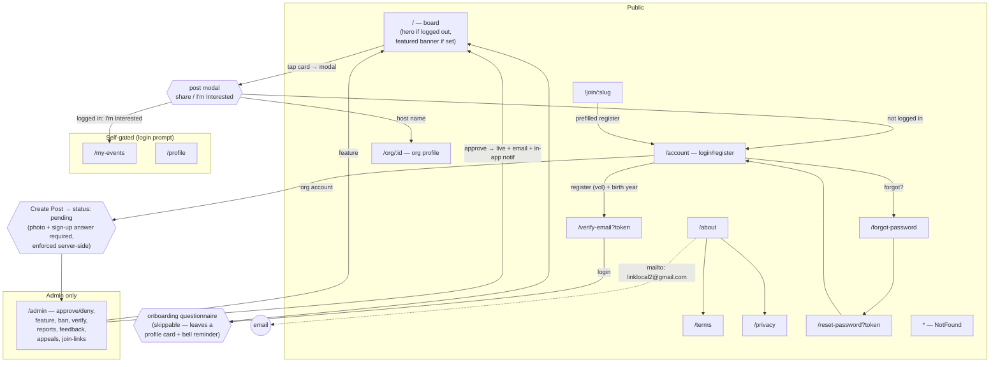

# LocalLink (lite) — Pre-Launch Site Map

Generated 2026-08-26 from the actual routes in `client/src/App.tsx` and `server/routes.ts`.
This is the build **without** the tracker, check-in or certificate system.

## Route access legend

- **PUBLIC** — renders for anyone
- **SELF-GATED** — route is public, page shows a "Please Login" prompt without a session (no server data leaks; APIs behind it require JWT)
- **ADMIN** — page self-gates client-side; every admin API requires `requireAdmin` server-side

## Frontend routes (all 13, from App.tsx)

| Route | Access | Notes |
|---|---|---|
| `/` | PUBLIC | Board. Logged-out hero; featured banner when an admin has featured a post; `?post=ID` deep-links open the modal (server serves OG tags to crawlers) |
| `/my-events` | SELF-GATED | Login prompt when logged out |
| `/about` | PUBLIC | Contact mailto + working Terms/Privacy buttons |
| `/profile` | SELF-GATED | Login prompt when logged out; carries the onboarding-questionnaire reminder card |
| `/account` | PUBLIC | Login/register; consumes join-link prefill from sessionStorage |
| `/admin` | ADMIN | Client gate + `requireAdmin` on all APIs. Eight tabs |
| `/verify-email` | PUBLIC | Token from email link |
| `/forgot-password` | PUBLIC | |
| `/reset-password` | PUBLIC | Token from email link; single-use |
| `/terms` | PUBLIC | Real content — **not** a stub |
| `/privacy` | PUBLIC | Real content — **not** a stub |
| `/org/:id` | PUBLIC | Org profile; linked from card host name + modal |
| `/join/:slug` | PUBLIC | Resolves link → stores prefill → redirects to `/account` (register tab, org name prefilled) |
| `*` | PUBLIC | NotFound page |

### Deliberately absent

No `/tracker`, `/checkin`, `/certificate`, `/shared-record` or `/how-it-works`. The Help / How
It Works tab is not hidden or emptied — it does not exist, because its entire content was
tracker and certificate instructions. Nothing in the nav or any page hints at them.

`/leaderboard` was a redirect stub back to `/` with nothing linking to it; deleted in `f5572f1`.

## Map

## Sample data

A fresh database seeds six approved opportunities hosted by six organization
accounts (`seed1`–`seed6`: EcoWarriors, MathGenius, SportsClub, FoodForAll,
GreenFuture, GreenThumb). Those accounts use `.example` addresses, have
notification email switched off, and cannot be logged into — the password
column holds a sentinel, not a hash. Seeding only runs when the opportunities
table is empty.

## Backend route surface (from routes.ts, for reference)

- Auth: register, login, verify-email, resend-verification, forgot/reset-password, profile (PUT), mark-welcome-seen — public where pre-auth, else `requireAuth`; all rate-limited appropriately
- Onboarding: `POST /api/me/onboarding`, `POST /api/me/onboarding/remind-later` (`requireAuth`)
- Board: opportunities (list/single, public), my-posts, create/edit/delete, signup/unsignup (`requireAuth`)
- Social: favorites CRUD, notifications list/read (`requireAuth`), reports (`requireAuth`), feedback (optionalAuth), appeals (public by design, rate-limited)
- Public pages: users/:id/profile (username + avatar + org website only), org/:id, featured-posts, join/:slug, unsubscribe (token), health
- Admin (all `requireAdmin`): users list/ban/unban/verify/delete, opportunities CRUD/approve/deny/feature, pending list, analytics, stats, reports, feedback, appeals, join-links
